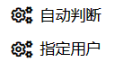

# Bili.Dynamic.AutoDel

## 功能

1. 自动删除B站 **已开奖的转发抽奖** 动态和 **源动态已被删除** 的动态
2. 选择性地删除自己转发的 **某个用户动态** 的转发动态

## 用法

首先需要安装油猴扩展，然后安装用户脚本。

[点击安装](https://raw.githubusercontent.com/monSteRhhe/bilibili-dynamic-del/main/bili-dynamic-autodel.user.js)

之后可以在B站网站内点击油猴菜单里的按钮使用：

1. 自动判断：就是自动删除源动态有互动抽奖功能且已经开奖的和源动态已被删除的转发动态
2. 指定用户：就是点击后在弹出窗口输入用户名或者该用户的数字UID并确定，能够删除源动态是这个用户动态的转发动态

## 其他

随缘更新~

​    

更多好用的可见：[awesome-bilibili-extra](https://github.com/HCLonely/awesome-bilibili-extra)
