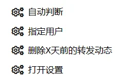

## 功能

1. 自动删除B站 **已开奖的转发抽奖** 动态和 **源动态已被删除** 的动态；

2. 自主选择删除转发的 **某个用户动态** 的转发动态；

3. 删除 **X天及之前** 发布的源动态的转发动态。

## 用法

首先需要安装油猴扩展，然后安装用户脚本。

[点击安装](https://raw.githubusercontent.com/monSteRhhe/bilibili-dynamic-del/main/bili-dynamic-autodel.user.js)

之后可以在B站网站内点击油猴扩展菜单里的按钮使用：

1. 自动判断：自动删除源动态有互动抽奖且已经开奖的动态和源动态已被删除的转发动态；
2. 指定用户：点击后在弹出窗口输入用户名或者该用户的数字UID并确定，能够删除源动态的作者是该用户的转发动态；
3. 删除X天前的转发动态：点击后在弹出窗口输入往前的天数，源动态在这天以及之前的日期发布的转发动态会被删除（感谢 **@MadGhostcn** 的建议）。

## 其他

黑猴子/脚本猫测试都可用。

在使用时要注意功能的适用范围：

- 这里的 **转发抽奖动态** 指的是是带有的，可以看到开奖倒计时和中奖用户的“互动抽奖”动态；

  **源动态已被删除的动态** 就是如图所示这种

- 指定用户的删除输入的则是源动态作者的用户名/UID，比如转发的是用户“ABCABC”（uid01234567）的动态，要删除自己转发的ta的动态，要输入的就是“ABCABC”或者“01234567”。
- 按日期删除输入的是往前推的天数，比如今天22号，要删除12号及之前的就输入10。判断的日期是转发的 **源动态发布的日期** 而不是转发动态的日期，范围是设定的日期及之前的日期。

先写这么多，之后我也会在平常使用中看看有没有什么问题，随缘更新，欢迎建议也感谢支持喵～(∠・ω< )⌒★

以上。

​    

更多好用的可见：[awesome-bilibili-extra](https://github.com/HCLonely/awesome-bilibili-extra)
